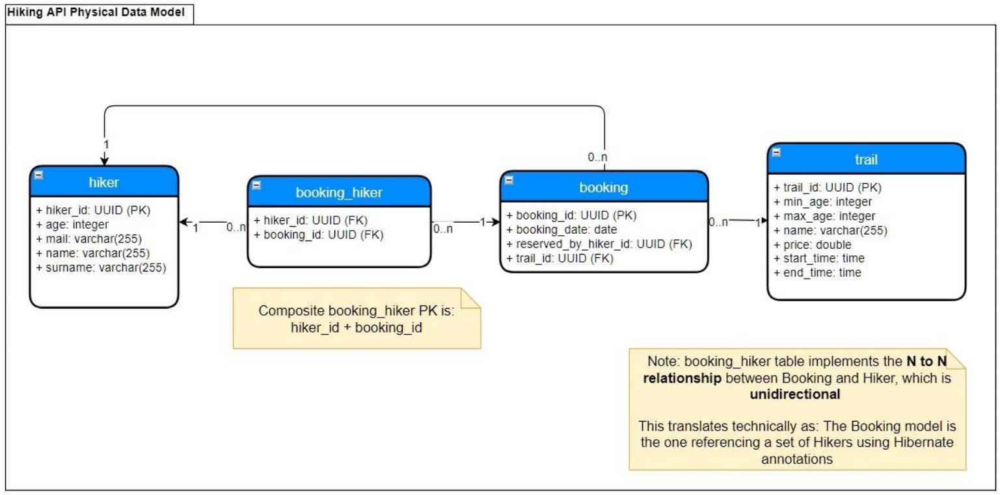
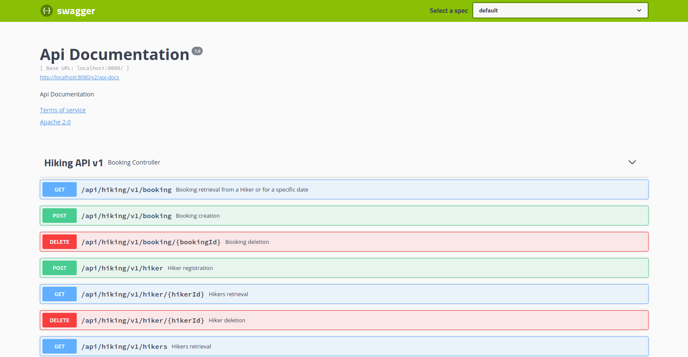

<h2>INSTRUCTIONS FOR THE CANDIDATE</h2>

This repository is the base for the live coding interview. 
We would like to know what the candidate thinks about the codebase and what could be eventually refactored/improved.

<h2>THE CODEBASE</h2>

<h3> Problem Domain </h3>
George is a local travel guide who provides private hiking tours of the mountains in his locality.
Hikers would contact him over the phone to go on three different hike trails: Shire, Gondor and
Mordor.
He would enter each booking request in a spreadsheet along with the hikers'
information. As the number of requests for his services are increasing, he is finding it difficult
to handle his business efficiently

<h3> Special conditions </h3>
<ul>
<li>A hiker must be within the specified age limit of the chosen hike trail</li>
<li>A hiker can include more than one hiker in his/her booking; provided that they are within
the age limit of the chosen hiking trail</li>
<li>Each booking should be for one hiking trail only</li>
</ul>

<h2>TECHNICAL DETAILS</h2>

<h3> Data Model </h3>

<h3> Tool versions </h3>
The app was developed using **IntelliJ 2018 3.5**

Spring Boot version: **5.1.6**

PostgreSQL version: **12.3**

docker-compose version: **1.25.5**

Docker compose will generate 2 containers: the first with the PostgreSQL DB containing the tables and the trail data and
the second with the spring-boot backend solution.
The test cases will generate (and delete, once tests are finished) sample hiker data to test the endpoint operations.

A Postman collection is available to test-out application functionalities

The API implements also swagger documentation

The Swagger documentation is accessible at the following URL once the containers are started:

**http://localhost:8080/swagger-ui.html#/Hiking_API_v1**
<h2>COMMANDS</h2>

Build the project and start docker Hiking API containers:

**./gradlew build -x test && docker-compose up**

Execute tests (after the containers are up):

**./gradlew test**

Remove containers for instance (in case a reset is needed):
**docker stop $(docker ps -a -q)**
and then:
**docker rm $(docker ps -a -q)**

